# 교직원 인사관리 시스템 — ERD (메뉴 구조 기반 재설계)

> 6개 대메뉴를 테이블로 매핑한 설계안입니다.
> **이 문서는 설계 산출물이며, 실제 백엔드 마이그레이션(V1~V4)에는 아직 반영하지 않았습니다.** (현재 코드는 기존 기업 HR 상태 유지)
> 시각화: `hris-erd.dbml` 파일 내용을 [dbdiagram.io](https://dbdiagram.io) 에 붙여넣으면 다이어그램이 생성됩니다. GitHub/Notion에서는 아래 Mermaid가 그대로 렌더됩니다.

---

## 1. 메뉴 → 테이블 매핑

| 대메뉴 | 세부기능 | 테이블 | 비고 |
|---|---|---|---|
| **① 인사기록 관리** | 인사기록카드 | `employee` | 인적사항 확장(생년월일/성별/주소/비상연락처) |
| | 학력 관리 | `education` | employee 1:N |
| | 경력 관리 | `career` | employee 1:N |
| | 자격증 관리 | `certification` | employee 1:N, 만료일 갱신 알림 |
| **② 인사발령 관리** | 발령 등록/승인 | `appointment` | 승인 상태머신 + 문서번호 채번 |
| | 발령 이력 조회 | `appointment` | 동일 테이블 조회 |
| **③ 근태/휴가 관리** | 출퇴근 현황 | `attendance` | (employee, work_date) UNIQUE |
| | 휴가 신청/승인 | `leave_request` | 승인 워크플로우 |
| | 잔여일수 대시보드 | `leave_balance` | (employee, year) UNIQUE |
| **④ 급여 연계 관리** | 기초 급여 조회 | `salary_basic` | 기본급+수당+계좌 |
| | 정산용 엑셀 다운로드 | — | `salary_basic` 조회 (신규 테이블 없음) |
| **⑤ 통계 대시보드** | 부서별 정원 현황 | `department.headcount` + `employee` 집계 | 신규 테이블 없음 |
| | 당일 근태 현황 | `attendance` 집계 | 신규 테이블 없음 |
| **⑥ 시스템 관리** | 권한 관리 (RBAC) | `role`, `permission`, `role_permission`, `employee_role` | 다대다 RBAC |
| | 공통 코드 관리 | `common_code` | group_code+code |
| | 감사로그 조회 | `audit_log` | 변경 전/후 JSON 보관 |

---

## 2. ER 다이어그램 (Mermaid)

```mermaid
erDiagram
    department ||--o{ department : "상위조직"
    department ||--o{ employee : "소속"
    position ||--o{ employee : "직급"
    employment_type ||--o{ employee : "임용구분"

    employee ||--o{ education : "학력"
    employee ||--o{ career : "경력"
    employee ||--o{ certification : "자격증"

    employee ||--o{ appointment : "발령대상"
    department ||--o{ appointment : "전/후 소속"
    position ||--o{ appointment : "전/후 직급"

    employee ||--o{ attendance : "근태"
    employee ||--o{ leave_request : "휴가신청"
    employee ||--o{ leave_balance : "연차잔여"

    employee ||--o{ salary_basic : "기초급여"

    employee ||--o{ employee_role : "권한"
    role ||--o{ employee_role : "부여"
    role ||--o{ role_permission : "권한매핑"
    permission ||--o{ role_permission : "포함"

    employee ||--o{ audit_log : "행위자"

    employee {
        bigint id PK
        varchar employee_number UK "사번"
        varchar name
        varchar email UK "로그인ID"
        varchar staff_category "FACULTY/STAFF"
        bigint department_id FK
        bigint position_id FK
        bigint employment_type_id FK
        varchar employment_status
        date hire_date
        date birth_date
        varchar gender
        varchar address
        varchar emergency_contact
    }
    department {
        bigint id PK
        varchar name
        varchar org_type "학사/행정"
        bigint parent_department_id FK
        int headcount "정원"
    }
    education {
        bigint id PK
        bigint employee_id FK
        varchar school_name
        varchar major
        varchar degree
        date graduation_date
        varchar status
    }
    career {
        bigint id PK
        bigint employee_id FK
        varchar company_name
        varchar position
        date start_date
        date end_date
    }
    certification {
        bigint id PK
        bigint employee_id FK
        varchar name
        varchar issuer
        date acquired_date
        date expiry_date
    }
    appointment {
        bigint id PK
        varchar document_number UK
        bigint employee_id FK
        varchar appointment_type
        bigint from_department_id FK
        bigint to_department_id FK
        varchar approval_status
        bigint approver_id FK
        date appointment_date
    }
    attendance {
        bigint id PK
        bigint employee_id FK
        date work_date
        time check_in_time
        time check_out_time
        varchar status
    }
    leave_request {
        bigint id PK
        varchar document_number UK
        bigint employee_id FK
        varchar leave_type
        date start_date
        date end_date
        decimal days
        varchar approval_status
    }
    leave_balance {
        bigint id PK
        bigint employee_id FK
        int year
        decimal total_granted
        decimal used_days
        decimal remaining
    }
    salary_basic {
        bigint id PK
        bigint employee_id FK
        decimal base_pay
        decimal meal_allowance
        decimal transport_allowance
        decimal position_allowance
        date effective_date
    }
    role {
        bigint id PK
        varchar code UK
        varchar name
    }
    permission {
        bigint id PK
        varchar code UK
        varchar resource
        varchar action
    }
    role_permission {
        bigint role_id PK,FK
        bigint permission_id PK,FK
    }
    employee_role {
        bigint employee_id PK,FK
        bigint role_id PK,FK
    }
    common_code {
        bigint id PK
        varchar group_code
        varchar code
        varchar name
        int sort_order
    }
    audit_log {
        bigint id PK
        bigint actor_id FK
        varchar action
        varchar entity_type
        bigint entity_id
        text before_data
        text after_data
    }
```

---

## 3. 기존 스키마 대비 변경점

| 구분 | 기존 (기업 HR) | 신규 (메뉴 기반) |
|---|---|---|
| 인사기록 | employee 단일 | employee + **education/career/certification** 분리 |
| 권한 | employee.role enum 1개 | **RBAC 4테이블** (role/permission/role_permission/employee_role) |
| 휴가 | 없음 | **leave_request/leave_balance** 신규 |
| 급여 | 없음 (프론트 목업만) | **salary_basic** 신규 |
| 공통코드 | 없음 (enum 하드코딩) | **common_code** — 코드 관리 화면으로 운영 |
| 감사 | created_at/updated_at만 | **audit_log** + created_by/updated_by/version 전 테이블 |
| 경조비/증명서 | 있음 | 이번 메뉴에 없음 → **보류/제거 대상** (판단 필요) |

> **경조비신청(event_support) / 증명서발급(certificate_issue)** 은 새 메뉴 6종에 포함되지 않습니다.
> 유지할지 제거할지 결정이 필요합니다. (참고사이트에는 있었으나 이번 요구 메뉴엔 없음)

---

## 4. 공통 규칙

- 모든 업무 테이블: `created_at, updated_at, created_by, updated_by, version, deleted` 공통 감사 컬럼
- 기준정보 테이블(department/position/employment_type/role): 추가로 `active` 플래그
- 삭제는 하드 삭제 금지, `deleted=true` 소프트 삭제
- 문서번호 채번: `appointment`(APT), `leave_request`(LVE) 등 연도별 순번 (`document_sequence` 테이블 재사용)
- 낙관적 락: `version` 컬럼으로 동시 수정 충돌 감지

---

## 5. 다음 단계 (승인 시 진행)

1. 이 ERD를 Flyway 마이그레이션(V1~Vn)으로 반영
2. RBAC 도입 → 기존 JWT의 단일 role → 다중 role/permission 기반 `@PreAuthorize` 전환
3. common_code 기반으로 휴가유형/발령유형 등 하드코딩 enum을 코드테이블로 이관
4. audit_log 자동 기록 (AOP 또는 Hibernate Envers 검토)
